# Spring 2018
# Project 1: Spooky Data Analysis


### [Project Description](doc/)
This is the first and only *individual* (as opposed to *team*) this semester. 

Term: Spring 2018

+ Project title: [a title]
+ This project is conducted by [your name]
+ Project summary: [a short summary] 

Following [suggestions](http://nicercode.github.io/blog/2013-04-05-projects/) by [RICH FITZJOHN](http://nicercode.github.io/about/#Team) (@richfitz). This folder is organized as follows.

```
proj/
├── lib/
├── data/
├── doc/
├── figs/
└── output/
```
## What are the frequent words used in the fictions?

First, let's take a look at the sentence length of each author.<br>
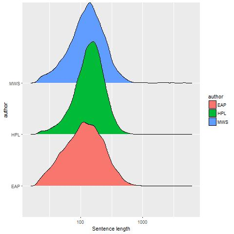
<br>
We can briefly conclude that the three authors differs little in the sentence length while all of them have preference focus in the sentence length.

Second, let's look at the words used in the fictions<br>
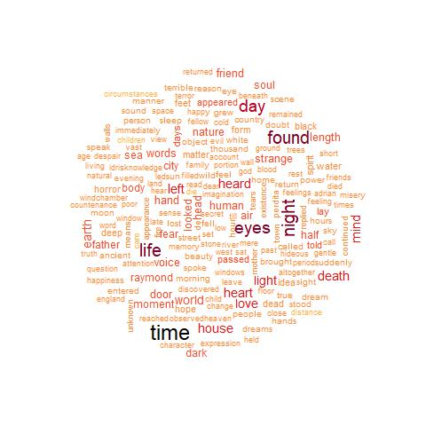<br>
Do they differ with regard to different authors? <br>
Mary's words:<br>

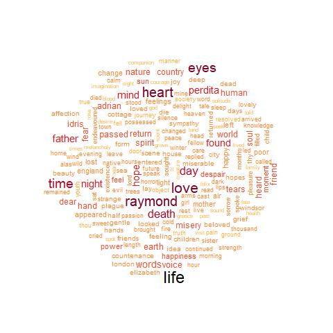<br>
Edgar's words:<br>
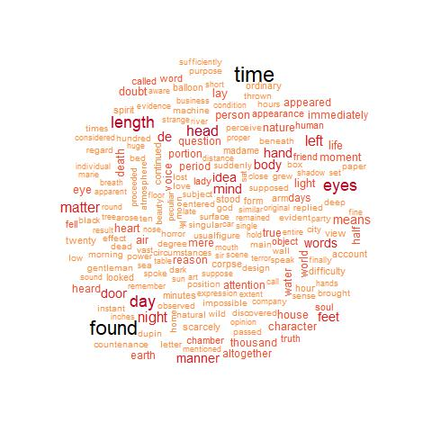<br>
Lovecraft's words:<br>
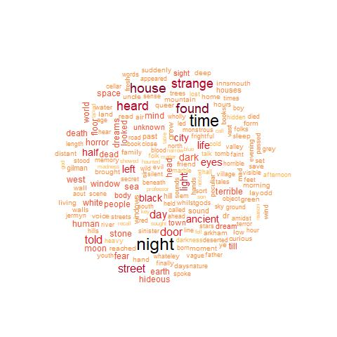<br>

I would say that Mary Shelley is more focused on the human body and relationships while others don't.
Are they alike in the words used? Maybe, we could compute it!<br>
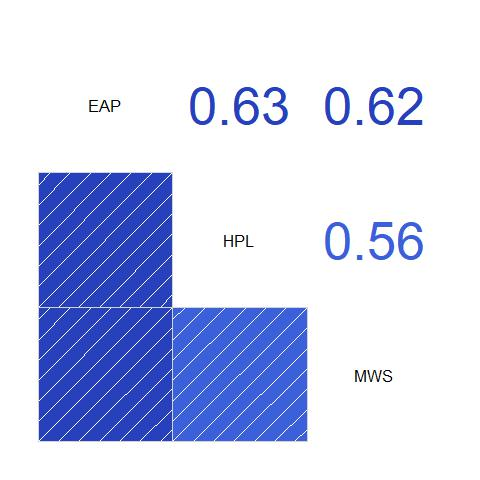<br>

By comparing the words used by each author, we now see that these horror fiction authors are alike in words. Among them,the most likelihood happens between HP Lovecraft and Edgar Allan Poe, even the least likelihood in words amounts to 0.56. By ordering the likelihood, Edgar and HP Lovecraft are the most alike authors, Edgar and Mary are the second likelihhod, Mary and HP Lovecraft is the least likelihood.

## How do they differ in the gender words?

Let’s compare some it.

### Female/Male words compare<br>

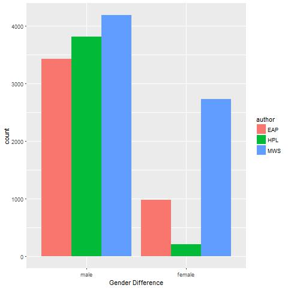<br>
Apparently, male characters are the leading gender in the horror fictions.
### Exact gender words difference<br>

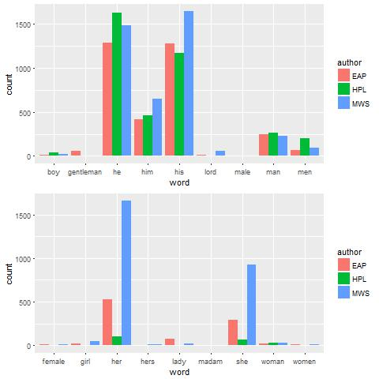<br>
### How are the words following after gender words?<br>
 
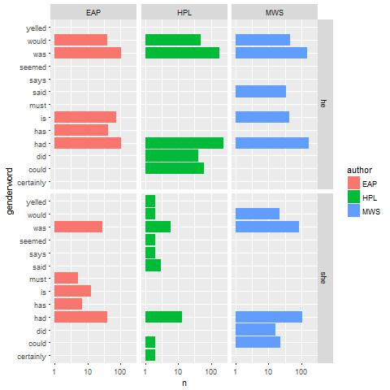<br>
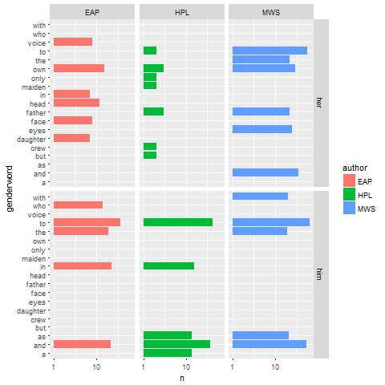<br>
Apparently, Mary is unique comparing to the others.

## Tf-idf compare
Before, we compare the words of each author's fiction. How do they differ when we 
use tf-idf method to calculate the importance?<br>
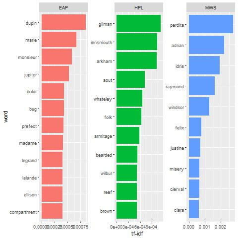<br>

And how is the similarities among the authors?<br>
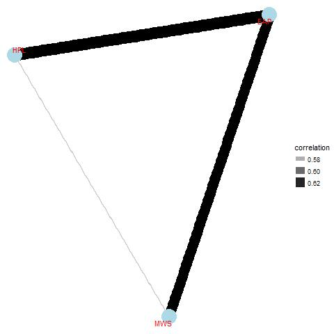<br>
The results are similar to the previous results. We may safely conclude that the authors are alike in the words with reagrd to the horror fiction theme.
## Sentiment Analysis of Spooky data.
In the sentiment analysis part, we'd like to measure the sentiment focus of different authors
Let's first take a look at the overall sentiment words.<br>

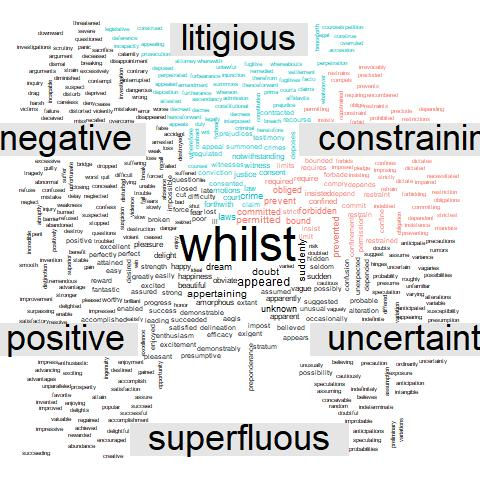<br>
Then, we look at the words separately.
For Mary:<br>
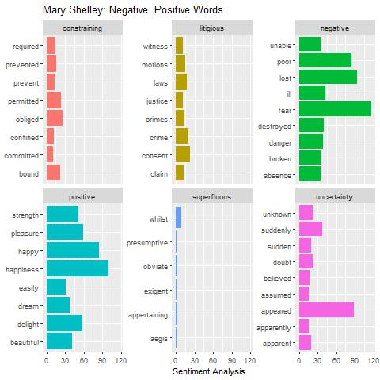<br>
For Edgar:<br>
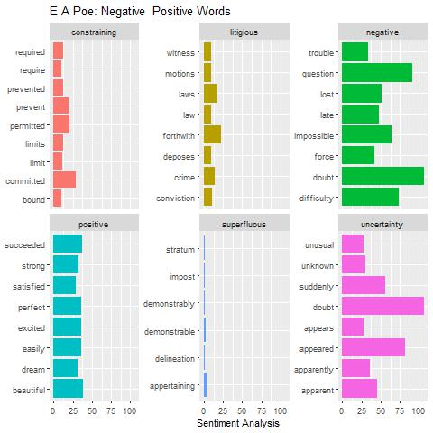<br>
For Lovecraft:<br>
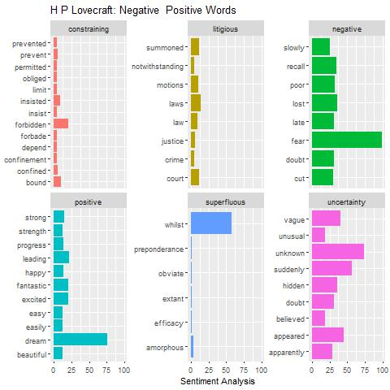<br>

Afterwards, we did a measurement to see the sentiment distirbution.<br>
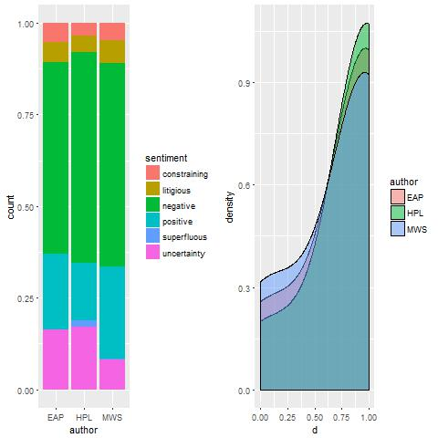<br>

## N-gram Analysis
Then, it is interesting to do the n-gram analysis.Here, we do the bi-gram analysis.<br>
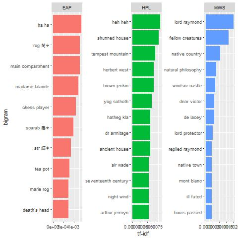<br>

## Topic Modelling
Afterwards, we use the LDA method to do the topic modelling.<br>

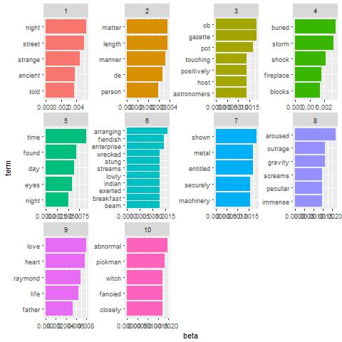<br>

And, compare the authors according to the topics.<br>
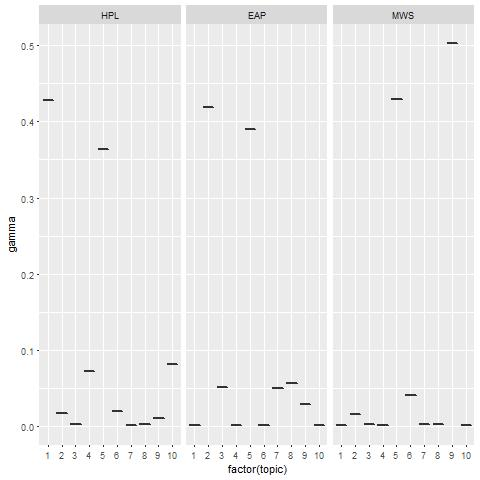<br>

Finally, we do the similarity analysis.<br>
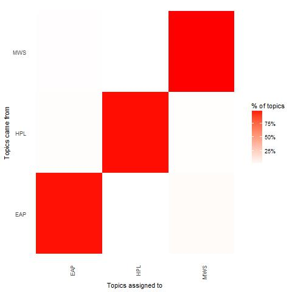<br>


# References: 
   1.https://www.kaggle.com/headsortails/treemap-house-of-horror-spooky-eda-lda-features <br>
   2. https://www.tidytextmining.com/

